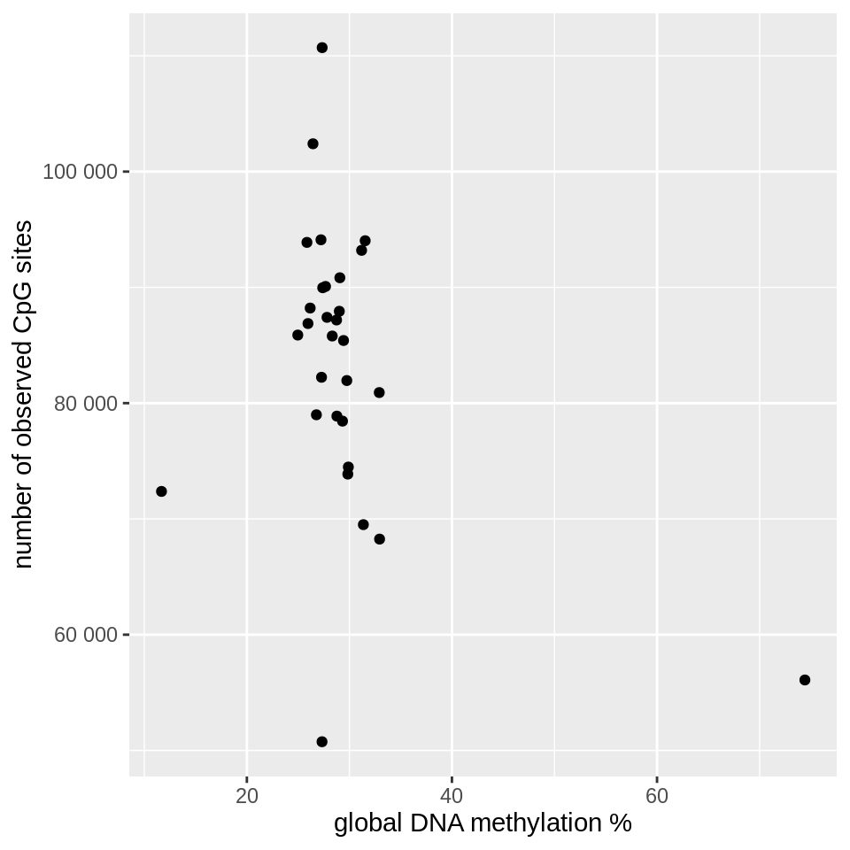
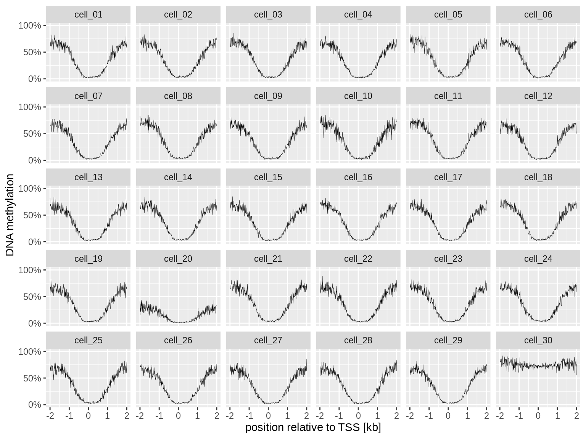
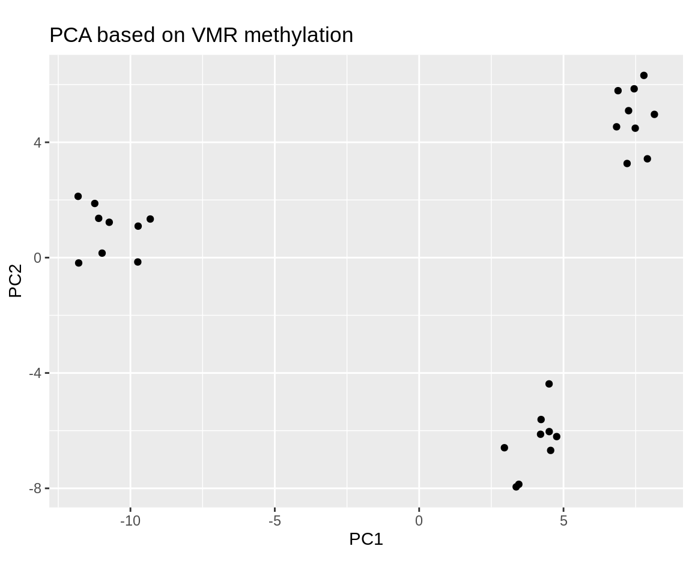
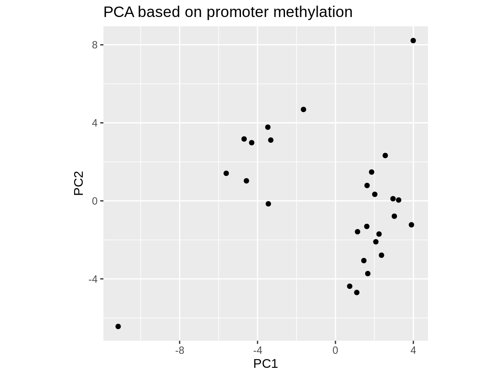
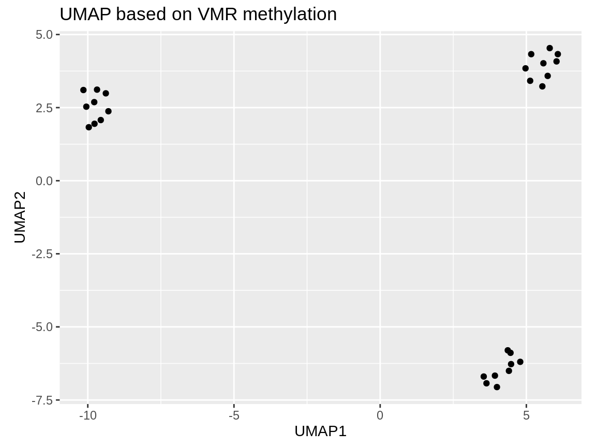
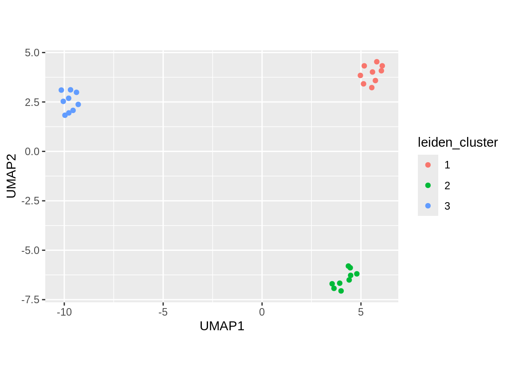
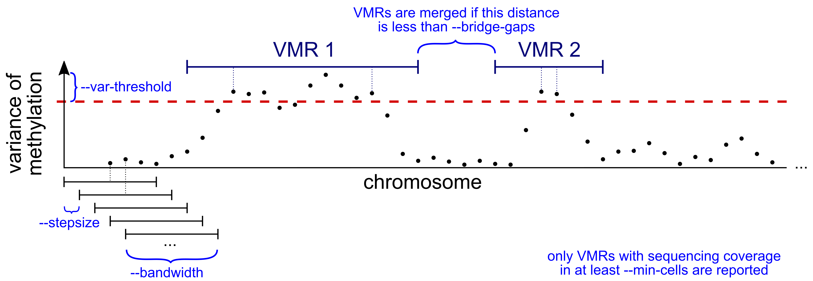

# Tutorial

This tutorial will show you how to use *MethSCAn* on a small example data set that we provide.
The overall run time is no longer than 2-5 minutes.
Hardware requirements for this tutorial are very low, this example analysis should run on any modern desktop computer or laptop.


## Usage principles

*MethSCAn* provides a number of commands.
To view the available commands, simply install *MethSCAn* and then type `methscan --help` (or just `methscan`) in your terminal.
Similarly, you can use `methscan [command] --help` to learn about each command and their arguments.
For example, use `methscan prepare --help` to learn how to use the `prepare` command.

A typical *MethSCAn* workflow consists of the following steps which will be explained in the course of this tutorial:
1. use `methscan prepare` to store single-cell methylation data in an efficient format
2. use `methscan filter` to filter low-quality cells
3. use `methscan scan` to discover variably methylated regions (VMRs) in the genome, or alternatively provide your own regions of interest
4. use `methscan matrix` to receive a methylation matrix analogous to the count matrix in scRNA-seq
5. use the methylation matrix for downstream analysis such as dimensionality reduction and clustering
6. optionally use `methscan diff` to find differentially methylated regions (DMRs) between two groups of cells


### What you will need

*MethSCAn* assumes that you
- used single-cell bisulfite-sequencing (scBS) to generate FASTQ-files of bisulfite-converted reads
- mapped the reads with a methylation-aware program
- extracted context-dependent methylation values (typically CpG or CH) from the alignments

The last two steps can be achieved with bulk bisulfite-sequencing tools such as [Bismark](https://www.bioinformatics.babraham.ac.uk/projects/bismark/) and the included `bismark_methylation_extractor` script.
Afterwards, you should be left with a simple tabular file for each cell.
Each file contains the methylation status of thousands of methylation sites (typically CpG-sites) in the whole genome.
Here are the first five lines of an example file, which is a CpG-specific `.cov`-file generated by Bismark:

```
1       100021800       100021800       100.000000      1       0
1       100023064       100023064       0.000000        0       1
1       100026855       100026855       100.000000      1       0
1       100027218       100027218       100.000000      2       0
1       100051671       100051671       0.000000        0       2
...
```

You should have one of these files per cell.

The columns denote the chromosome name, the start and end coordinates of the methylation site (identical in this case), the observed percentage of methylation (typically 0% or 100% in single-cell data), the number of reads that are methylated at that site, and the number of unmethylated reads.
If you did not use Bismark and your files have a slightly different format, don't worry.
We support a range of different input formats and you can even define your own custom format (see `methscan prepare --help`).

*MethSCAn* supports both uncompressed and gzip-compressed input files, as long as any gzipped files end in `.gz`.


## Download our tutorial data set

In this tutorial, we will analyze a small example data set with just 30 cells. If you want to follow along and try it yourself, you can download the data here:
- Linux or Mac: download [scbs_tutorial_data.tar.gz](https://heibox.uni-heidelberg.de/f/0a74cc5fd8a141a4bab8/?dl=1) and unpack it with `tar -xvzf scbs_tutorial_data.tar.gz`.
- Windows: download [scbs_tutorial_data.zip](https://heibox.uni-heidelberg.de/f/d1d3b9407b44473b808f/?dl=1) and unpack.


### 1. Preparing your *MethSCAn* run

The first step of any *MethSCAn* workflow is to collect the methylation data of all single-cell files in order to store it in a more efficient format.
This can be achieved with the command `methscan prepare`:

```bash
methscan prepare scbs_tutorial_data/*.cov compact_data
```

This command will take all files ending in `.cov` in the `scbs_tutorial_data` directory and efficiently store their methylation values in a new directory called `compact_data`.
`methscan prepare` is the only step that requires the raw data, all other *MethSCAn* commands work directly with `compact_data`.
If you're working with your own data and you sequenced thousands of cells, `methscan prepare` will take quite long.
But fortunately, you only have to run it once in the very beginning.

> [!NOTE]  
> If you encounter a "too many open files"-error, you need to increase the open file limit with e.g. `ulimit -n 99999`.

### 2. Filtering low-quality cells

Due to various technical issues such as empty wells / droplets and incomplete bisulfite conversion, every scBS experiment comes with a hopefully small number of low-quality cells.
It is recommended to identify and remove these cells before proceeding with the analysis.
In this tutorial we will look at three quality measures:
1. The number of observed methylation sites (this usually depends on the read number)
2. The global methylation percentage
3. The average methylation profile of transcription start sites

Measures 1 and 2 can be found in `compact_data/cell_stats.csv`.
You can easily visualize these quality measures using a method of your choice.
Here, we use R:

```r
library(tidyverse)

cell_stats <- read_csv("compact_data/cell_stats.csv")

cell_stats %>% 
  ggplot(aes(x = global_meth_frac * 100, y = n_obs)) +
  geom_point() +
  labs(x = "global DNA methylation %", y = "# of observed CpG sites")
```



You can clearly see that there are three outlier cells, characterized by a low number of observed CpG sites or an unusual global methylation percentage.
Note that we're dealing with a small toy data set here, and the numbers will look quite different in a real experiment!

Finally, we also inspect the average methylation profile around transcription start sites (TSSs) for every cell.
Why?
Our tutorial data set consists of mouse cells, and it is known that DNA methylation is globally high in mouse, but low around TSSs.
Every cell that strongly deviates from this expectation is suspicious and a candidate for filtering, so we use `methscan profile` to help visualize the average methylation around TSSs:
```bash
methscan profile --strand-column 6 scbs_tutorial_data/Mus_musculus.GRCm38.102_TSS.bed compact_data TSS_profile.csv
```
Again, we can use R or any other language to inspect the TSS profiles:
```r
library(tidyverse)

profile_df <- read_csv("TSS_profile.csv") %>% 
  mutate(position_binned = round(position, -1L)) %>% 
  group_by(position_binned, cell_name) %>% 
  summarise(meth_frac = mean(meth_frac)) %>% 
  ungroup()

profile_df %>% 
  ggplot(aes(x = position_binned / 1000, y = meth_frac)) +
  scale_y_continuous(labels=scales::percent_format(accuracy=1), limits=c(0, 1), breaks=c(0, .5, 1)) +
  geom_line(size=.1) +
  facet_wrap(~cell_name) +
  labs(x = "position relative to TSS [kb]", y = "DNA methylation")
```



There are only two cells that have a suspicious profile: `cell_20` and `cell_30`.
If you dig into the data yourself, you will find that these two cells are among the three outliers in our previous plot.
However, in a real data set you might also discover cells that have good quality measures, but a poor TSS profile.
In most cases, these cells should be filtered.

Let's filter all three low-quality cells from the data set:
```bash
methscan filter --min-sites 60000 --min-meth 20 --max-meth 60 compact_data filtered_data
```
This command removes cells with less than 60,000 observed methylation sites, less than 20% global methylation, and more than 60% global methylation (these values would look very different in a real experiment).
If you want full control over which cells will be filtered, you can also select cells by their name, see `methscan filter --help` for details.

We can now proceed with the quality-filtered data, stored in `filtered_data`.


### 3. Discovering variably methylated regions (VMRs)

The starting point of every single-cell RNA-seq analysis is a gene × cell (or cell × gene) count matrix that can be used for downstream analyses such as dimensionality reduction or clustering.
But single-cell methylation data is genome-wide and not limited to genes, hence we need to define genomic regions of interest.
A common strategy is to simply quantify methylation at promoters or gene bodies.
But not all methylation differences occur at promoters or gene bodies, hence we propose to discover variably methylated regions (VMRs) in the data itself.
This can be achieved with `methscan scan`.

Before you can run `methscan scan` for the first time, you will need to run `methscan smooth` once.
This command simply treats all your single cells as a pseudo-bulk sample and calculates the smoothed mean methylation along the whole genome.
This information is required for VMR detection, and later, for obtaining a methylation matrix.

```bash
methscan smooth filtered_data
```

Now that `filtered_data` is smoothed, we can proceed with the VMR detection:

```bash
methscan scan --threads 4 filtered_data VMRs.bed
```
We use the option `--threads 4` in order to run the program on 4 CPU threads in parallel. If you want to use all available threads, simply omit the `--threads` option altogether.
The result is a [BED](https://en.wikipedia.org/wiki/BED_(file_format))-like file that lists the genomic coordinates (chromosome, start, end) of regions where methylation is variable between cells, as well as the methylation variance of the region:
```
2       3194798 3197978 0.07718534715010719
2       3379038 3381638 0.08048814475349723
2       4295158 4299148 0.06783578568141418
2       4443928 4446178 0.07310900984059789
2       4544208 4546518 0.08275669639137119
...
```

### 4. Obtaining a methylation matrix

Finally, you can quantify the mean methylation of the VMRs that we just discovered using `methscan matrix`:
```bash
methscan matrix --threads 4 VMRs.bed filtered_data VMR_matrix
```
The output directory `VMR_matrix` contains the cell × region methylation matrix that lists the average methylation of all regions (here: VMRs) in all cells.
It is similar to the count matrices generated in scRNA-seq experiments.
You can find the average methylation of each region in `VMR_matrix/methylation_fractions.csv.gz`.
Here is a peek of this matrix:

|         | 1:7844602-7846612 | 1:8409032-8412852 | 1:10376412-10378562 | ... |
|---------|-------------------|-------------------|---------------------|-----|
| cell_01 |                   | 1.0               |                     |     |
| cell_02 |                   | 1.0               | 0.6666667           |     |
| cell_03 |                   | 0.0               | 1.0                 |     |
| cell_04 | 1.0               | 0.3333333         | 0.0                 |     |
| ...     |                   |                   |                     |     |

Note that the matrix contains many missing values.
You can also see that the measured methylation values look like fractions with a small denominator (e.g. 1/1, 2/2, 1/3, ...).
Both of these observations are characteristic for single-cell methylation data:
Due to the low sequencing coverage of single cell methylomes, each region contains only very few reads, or no reads at all.
As a result, we only know the methylation status of very few (or no) CpG sites in each region.
The output directory also contains the number of methylated CpG sites, and the number of CpG sites with sequencing coverage, for each region (i.e. the numerators and denominators of the methylation fractions).

To mitigate the issues introduced by low coverage, we also report an alternative measure of methylation: the mean shrunken residuals of each region, reported in `VMR_matrix/mean_shrunken_residuals.csv.gz`.
These methylation estimates are less affected by random variations in read coverage and read positioning within the region.
This methylation matrix can now be used to distinguish different cell types in the sample, perform PCA and/or UMAP, or perform clustering.

If you want, you can also get a methylation matrix of specific genomic features that you are interested in.
For example, here we quantify methylation of promoters in the mouse genome:
```bash
methscan matrix --threads 4 scbs_tutorial_data/mouse_promoters.bed filtered_data promoter_matrix
```


### 5. Downstream analysis

Now we can import our methylation matrix into a scripting language of our choice for downstream analysis.
In this tutorial, we chose to use R.
We first read the cell × region methylation matrix into R.
Here we chose to use the shrunken residuals as our measure of methylation.

```r
library(tidyverse)
library(irlba)

meth_mtx <- read.csv("VMR_matrix/mean_shrunken_residuals.csv.gz", row.names=1) %>%
  as.matrix()
```

The methylation matrix is similar to a scRNA-seq count matrix, but one major difference is that it contains missing values.
This is because the coverage of every single cell is low, which means that there are plenty of genomic intervals that did not receive a single sequencing read.
To counter this, we propose a simple and straightforward way to deal with missing data in the input matrix to a PCA: In a first iteration, we replace each missing value in the centered input matrix with zero, then run the PCA. Then, these zeroes are replaced by the value predicted by the PCA and the PCA is rerun.

Below, you can find an R function that implements this approach:
```r
# PCA that iteratively imputes missing values
prcomp_iterative <- function(x, n=10, n_iter=50, min_gain=0.001, ...) {
  mse <- rep(NA, n_iter)
  na_loc <- is.na(x)
  x[na_loc] = 0  # zero is our first guess

  for (i in 1:n_iter) {
    prev_imp <- x[na_loc]  # what we imputed in the previous round
    # PCA on the imputed matrix
    pr <- prcomp_irlba(x, center = F, scale. = F, n = n, ...)
    # impute missing values with PCA
    new_imp <- (pr$x %*% t(pr$rotation))[na_loc]
    x[na_loc] <- new_imp
    # compare our new imputed values to the ones from the previous round
    mse[i] = mean((prev_imp - new_imp) ^ 2)
    # if the values didn't change a lot, terminate the iteration
    gain <- mse[i] / max(mse, na.rm = T)
    if (gain < min_gain) {
      message(paste(c("\n\nTerminated after ", i, " iterations.")))
      break
    }
  }
  pr$mse_iter <- mse[1:i]
  pr
}
```

We simply run our modified PCA on the centered methylation matrix...
```r
pca <- meth_mtx %>%
  scale(center = T, scale = F) %>%
  prcomp_iterative(n = 5)  # increase this value to e.g. 15 for real data sets

pca_tbl <- as_tibble(pca$x) %>% 
  add_column(cell=rownames(meth_mtx))
```

...and then plot the PCA, revealing three cell types with distinct methylomes:
```r
pca_tbl %>% 
  ggplot(aes(x = PC1, y = PC2)) +
  geom_point() +
  coord_fixed() +
  labs(title="PCA based on VMR methylation")
```



Of course you can also use PCA on the promoter methylation matrix instead of the VMR matrix by simply loading `promoter_matrix/mean_shrunken_residuals.csv.gz` instead of `VMR_matrix/mean_shrunken_residuals.csv.gz`.
This matrix yields a visually similar PCA, although the three cell types are not as cleanly separated:




#### UMAP
Uniform Manifold Approximation and Projection for Dimension Reduction (UMAP) is a data visualization technique that is commonly used in the single-cell sequencing field.
In single-cell transcriptomics, it is common practice to use the principal components as input for UMAP. We employ the same strategy here:

```r
library(uwot)  # R package for UMAP

umap_obj <- uwot::umap(pca$x, min_dist=0.05, n_neighbors=5, seed=2, ret_nn=T)
umap_tbl <- umap_obj$embedding %>%
  magrittr::set_colnames(c("UMAP1", "UMAP2")) %>% 
  as_tibble() %>% 
  add_column(cell=rownames(meth_mtx))

umap_tbl %>% 
  ggplot(aes(x = UMAP1, y = UMAP2)) +
  geom_point() +
  coord_fixed() +
  labs(title="UMAP based on VMR methylation")
```



This is our UMAP. For this very simple example data set, it's a little pointless because the three clusters were already very clearly separated on the first two principal components.


#### Cell clustering
Just like UMAP, Leiden clustering needs a neighbor graph as input. The UMAP function automatically computes this neighbor graph for us, and we can obtain it from the UMAP object because we specified `ret_nn=T`.
We can run Leiden clustering as follows:
```r
library(igraph)  # R package for graph manipulation, also implements the Leiden algorithm

# get the edges of the neighbor graph from the UMAP object
neighbor_graph_edges <- 
  tibble(from = rep(1:nrow(umap_obj$nn$euclidean$idx), times=ncol(umap_obj$nn$euclidean$idx)),
         to = as.vector(umap_obj$nn$euclidean$idx),
         weight = as.vector(umap_obj$nn$euclidean$dist)) %>%
  filter(from != to) %>%
  mutate(from = rownames(meth_mtx)[from],
         to = rownames(meth_mtx)[to])

# run Leiden clustering
clust_obj <- neighbor_graph_edges %>%
  igraph::graph_from_data_frame(directed=F) %>% 
  igraph::cluster_leiden(resolution_parameter = .5)  # adjust the resolution parameter to your needs

# put the clustering results into a data frame (tibble) for plotting
clust_tbl <- tibble(
  leiden_cluster = as.character(clust_obj$membership),
  cell = clust_obj$names
) %>% 
  full_join(umap_tbl, by="cell")

clust_tbl %>% 
  ggplot(aes(x = UMAP1, y = UMAP2, color = leiden_cluster)) +
  geom_point() +
  coord_fixed()
```




### 6. Finding differentially methylated regions (DMRs)

Now that we know that our sample consists of three groups of cells with different methylomes, the next step is to ask where in the genome methylation differs between those putative cell types.
To scan the genome between two groups of cells, you can use `methscan diff`.
For this tutorial, I am going to compare the methylomes of the cells in Leiden cluster 2 to the cells in Leiden cluster 3.
I will call these two groups of cells group_A and group_B.
`methscan diff` needs a simple comma-separated text file that lists which cell belongs to which group, like this:

```
cell_01,-
cell_02,-
cell_03,-
cell_04,-
cell_05,-
cell_06,-
cell_07,-
cell_08,-
cell_09,-
cell_11,group_A
cell_12,group_A
cell_13,group_A
cell_14,group_A
cell_15,group_A
cell_16,group_A
cell_17,group_A
cell_18,group_A
cell_19,group_A
cell_21,group_B
cell_22,group_B
cell_23,group_B
cell_24,group_B
cell_25,group_B
cell_26,group_B
cell_27,group_B
cell_28,group_B
cell_29,group_B
```


The cells I labeled with the group `-`, i.e. cells in Leiden cluster 1, are not part of the comparison.
I generated this text file as follows:
```r
clust_tbl %>%
  mutate(cell_group = case_when(
    leiden_cluster == "1" ~ "-",
    leiden_cluster == "2" ~ "group_A",
    leiden_cluster == "3" ~ "group_B")) %>% 
  dplyr::select(cell, cell_group) %>%
  write_csv("cell_groups.csv", col_names=F)
```

Once you have this file, you can run `methscan diff` to find DMRs between group_A and group_B:

```bash
methscan diff --threads 4 filtered_data cell_groups.csv DMRs.bed
```

The output file `DMRs.bed` contains a list of DMRs, their genome coordinates, the methylation difference measured by the t-statistic, and an adjusted p-value for each DMR.
One way to explore potential functions of these DMRs is to use tools such as [GREAT](http://great.stanford.edu).

Of course you can tweak the parameters of both `scan` and `diff` to your needs. If you are primarily interested in large stretches of differentially methylated DNA, for instance, you can increase the bandwidth of the sliding window and/or use `--bridge-gaps` to merge small VMRs/DMRs that are very close. The parameters of `scan` and `diff` are visually explained in this schematic:



### Considerations for real data sets
The tutorial data set is pretty small and its easy to distinguish the three clusters. For real data sets, you might need to adjust some parameters:
1. Just like in single-cell transcriptomics, you need to tweak some parameters to suit your dataset. For instance, you usually want to consider more than the 5 principal components we used here (e.g. 15).
Similarly, `n_neighbors=5` makes sense for our tiny data set, but since you probably have way more cells you have to increase this parameter accordingly, e.g. to 30. It's can also be worth exploring different clustering resolution parameters.
2. The built-in R function `read.csv` is quite slow. A faster alternative is `fread` from the `data.table` package:
```r
meth_mtx <- "VMR_matrix/mean_shrunken_residuals.csv.gz" %>% 
  data.table::fread(sep=",") %>%
  as.matrix(rownames=1)
```


### Advanced usage

#### Using stdin and stdout
If you want to use stdin and stdout instead of providing input/output file paths, you can use the `-` character where you would otherwise write the path to the file.
This makes it easy to incorporate other tools such as `bedtools` into your workflows.
For example, consider a workflow where you first want to sort your genomic input regions with `bedtools sort`, then you want to quantify methylation at these regions with `methscan matrix`:
```bash
bedtools sort -i unsorted.bed > sorted.bed
methscan matrix sorted.bed filtered_data output
```
Using stdin and stdout, this workflow can be simplified:
```bash
bedtools sort -i unsorted.bed | methscan matrix - filtered_data output
```


#### Filtering cells by name
If you want to control which exact cells are filtered from your data, you can also specify cells directly by their name.
Just create a plain text file that lists the names of the cells you want to keep, with each name on a new line (same format as `compact_data/column_header.txt`).
Cell names are derived from the name of the input file, e.g. `cell_1.cov.gz` becomes `cell_1`.

Once you have this file, you can either use it as a whitelist...
```bash
methscan filter --cell-names cells_to_keep.txt --keep compact_data filtered_data
```
...or a blacklist:
```bash
methscan filter --cell-names cells_to_discard.txt --discard compact_data filtered_data
```
